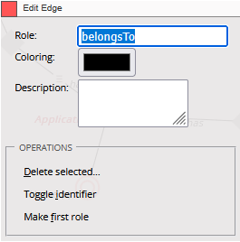

# Edge

An Edge is a specialized kind of Tie that connects two instances of the same or different anchors, but with an explicit direction (like a graph edge).

Think of an edge as:

“A relationship that has a from and to side.”

It’s like turning your anchor model into a graph model (nodes = anchors, edges = relationships).

Edges are introduced to handle `recursive or hierarchical structures` more elegantly.

## Fields

### Toggle identifier

In Anchor Modeling, every Anchor represents a set of identities.

Each identity (row) can toggle between being `active or inactive over time` — this is where the toggle identifier comes in.

A toggle identifier is a surrogate key (typically an integer or bigint) that uniquely identifies an instance of an anchor — and allows activation/deactivation over time without losing its historical references.

It is called a toggle identifier because:

It allows you to “toggle” an entity’s existence or state in and out of the active set, while keeping its full history intact.

### Make First Role

